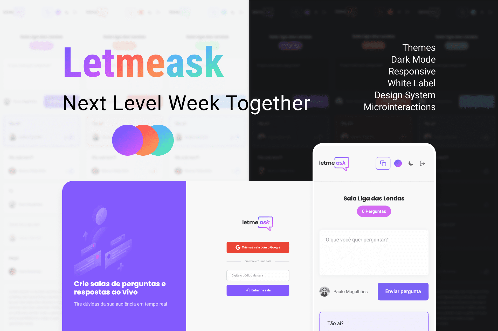

<p align="center">
    
</p>

<br />

# Let Me Ask

This project was developed during **[Next Level Week Together](https://nextlevelweek.com/)**, from the 20th to the 27th of June 2021.

Extra `features` have been added in addition to the proposed development:

- `Themes`
- `Dark Mode`
- `Accessible`
- `Responsive`
- `White Label`
- `Design System`
- `Microinteractions`
- `SEO-friendly`
- `Production-ready`
- `Developer Experience`

<br />

# 🎨 Prototype

- [Figma](https://www.figma.com/community/file/1009824839797878169/Letmeask)

<br />

# 📝 Prerequisites

- [Git](https://git-scm.com/) v2.x
- [Node](https://reactjs.org/) v14.x
- [Yarn](https://yarnpkg.com/) v1.22.x

<br />

# 🧪 Features

Developer experience first:

- 🔥 [Next.js](https://nextjs.org) for SSG or SSR
- 🎨 [Tailwind CSS](https://tailwindcss.com) with JIT mode
- 💾 [Firebase](https://firebase.google.com) to provide Realtime Database
- 🎉 Type checking [TypeScript](https://typescriptlang.org)
- ✅ Strict Mode for TypeScript and [React](https://reactjs.org)
- ✏️ Linter with [ESLint](https://eslint.org) (default NextJS and Core Web Vitals)
- 🛠 Code Formatter with [Prettier](https://prettier.io) and [EditorConfig](https://editorconfig.org/)
- 🦊 [Husky](https://typicode.github.io/husky) for Git Hooks
- 🚫 [Lint-staged](https://github.com/okonet/lint-staged) to run linter only on staged files
- 🗂 [VSCode](https://code.visualstudio.com/) configuration: Settings and Extensions for ESLint, Prettier, TypeScript and Tailwind CSS
- 🤖 SEO metadata, JSON-LD and Open Graph tags with Next SEO
- 💯 Maximize [Lighthouse](https://developers.google.com/web/tools/lighthouse) score

Built-in feature from Next.js:

- ☕ Minify HTML & CSS
- 💨 Live reload
- ✅ Cache busting

Philosophy:

- ♿ Accessible
- 📱 Mobile-first (Responsive everything)
- 🤖 SEO-friendly
- 🚀 Production-ready

<br />

# 💻 Getting Started

First, create a project in [Firebase](https://firebase.google.com/) to provide a Realtime Database.

Set environment variables in `.env.local` following `.env.example`

<br />

Now, run the development server:

```bash
# Install dependencies
yarn install

# Runs the app in development mode
yarn dev
```

Open [http://localhost:3000](http://localhost:3000) with your browser to see the result.

<br />

# 🔥 Production

You can see the results locally in production mode with:

```bash
# Runs the app in production mode
yarn prod
```

The generated HTML and CSS files are minified (built-in feature from [Next.js](https://nextjs.org)). It will also removed unused CSS from [Tailwind CSS](https://tailwindcss.com).

<br />

# 🚀 Deploy with [static export](https://nextjs.org/docs/advanced-features/static-html-export)

You can create an optimized production build with:

```bash
# Optimized production build with static export
yarn export
```

Now, is ready to be deployed. All generated files are located at `out` folder, which you can deploy with any hosting service.

`or`

just [deploy to Vercel](https://nextjs.org/learn/basics/deploying-nextjs-app/deploy)

<br />

# 📝 License

Licensed under the [MIT License](LICENSE), Copyright © 2021
